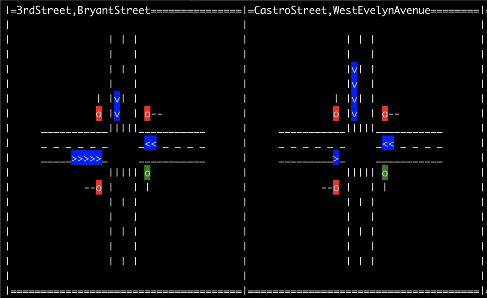

# Transactional API example: traffic lights



This example showcases a state-less (no persisted state) transactional process
that transactionally reads input from a Kafka topic, does some processing,
produces the result to an output topic, and commits it all in a transaction.

The application scenario is a system for managing the traffic lights
of road intersections, with four ingress roads and corresponding traffic
lights called "north", "east", "south" and "west".
As cars come in to the intersection the processor does a weighted election
on what road's traffic light to turn green or red.


## Input

The input topic is a stream of cars coming into an intersection, where
each input message corresponds to a car coming in to the intersection
on an ingress road.
The input message key is the intersection name while the message value is
the ingress road name.

See [generator.go](generator.go).


## Processor

The transactional process reads these input messages, decides which traffic
lights should turn red or green, and produces a transactional message for
each intersection to set its traffic lights.

The input and output topics are keyed with the intersection name.

See [processor.go](processor.go).


## Output visualizer

A simply terminal based visualizer reads from the output topic to
visualize the traffic lights and waiting cars for each intersection.

See [visualizer.go](visualizer.go).


## Transactional semantics

*Note*: Prior to KIP-447 being supported, one transactional producer is
created per assigned input partition, as this is currently the only way to
ensure that input topic offsets are committed synchronously with the transaction.

The semantics of the input-process-output transactional application is:

 * Create a consumer subscribing to the input topic.
 * When the consumer is rebalanced and receives an assignment we
   create a dedicated transactional producer per **input** partition.
   The transactional producer is initialized (init_transactions()) and a new
   transaction is started (begin_transaction()) in the rebalance callback.
   The consumer will start consuming from the last committed offsets.
 * Messages from the input topic partitions are processed and output messages
   are produced to the output topic (the output partition need not match
   the input partition).
 * The transaction is committed, the consumer position is committed to the
   consumer group as part of the transaction. If any part of the commit fails the
   current transaction is aborted and the input partition consume position
   is rewinded to where the transaction started, allowing the processor to
   retry the transaction in its entirety.
 * When the consumer is rebalanced and its assignment is revoked
   we abort the current transaction for all the producers, delete the producers,
   and wait for a new assignment.

See [txnhelpers.go](txnhelpers.go).


## How to run

```golang

$ go build
$ ./transactions_example $MY_BROKERS

# Wait for intersections to show.
# Hit escape to exit.
```
